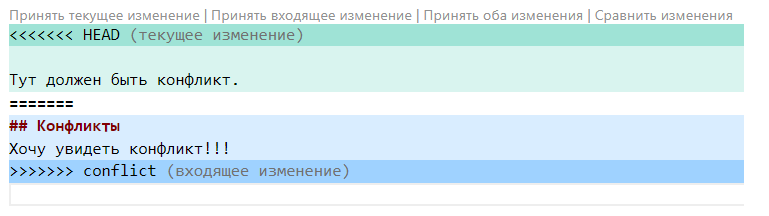

# Работа с git
## Проверка наличия установленного git
В терминале выполняем команду git version. Если Git установлен, то появится сообщение с информацией о версии. Иначе будет сообщение об ошибке.
## Настройка Git
При первом использовании Git необходимо представиться. Для этого вводим две команды: git config --global user.email. 
git config --global user.name. 
Для проверки регистрации используем команду git config --list.
## Инициализация репозитория
Для того, чтобы получить репозиторий из папки выполняем команду git init. В исходной папке появится скрытая папка .git
## ДЗ! Описать команды:
git status - используется, чтобы посмотреть текущее состояние файлов и их изменений в репозитории;

git add - используется для добавления изменений в отслеживание;

git commit - позволяет сохранить (записать) проделанные изменения в репозитории;

git log - позволяет просмотреть историю коммитов;

git diff - позволят сравнить разницу состояний между файлами;

git checkout - Позволяет переключаться между ветками репозитория. 

## Добавление картинок и игнорирование файлов
Для того, чтобы разместить картинку в нашем файле необходимо добавить ее в папку. После чего она должна отобразиться в проводнике. Внужном месте в файле прописываем следующую команду: 
Для того, чтобы удалить файлы с изображениями из отслеживания, надо создать файл .gitignore.
Чтобы убрать все файлы формата png в .gitignore пишем *.png

## Ветвление
Для создания новой ветки необходимо ввести команду git branch и имя новой ветки. Ветвление необходимо для работы с файлами в отдельной ветке, сохраняя при этом исходное состояние файла до их слияния. Чтобы отобразить созданные ветки используется команда git branch. Чтобы перейти на другую ветку вводим в терминале команду git checkout и имя ветки.

Тут должен быть конфликт.
## Конфликты
Хочу увидеть конфликт!!!

Конфликты возникают при слиянии двух веток в одну и когда в этих ветках была изменена одна и та же строка (строки) файла. Разрешение конфликта возможно путем следующих методов: принять входящие изменения, текущие, оба изменения, сравнить изменения. Выглядит это так:

## Домашнее задание №2
Дополнить инструкцию своими скринами:
добавление картинок;
ветвление;
слияние веток;
разрешение конфликтов;
удаление веток.
Создать и слить минимум четыре ветки. Скрин этих веток должен быть в инструкции.
